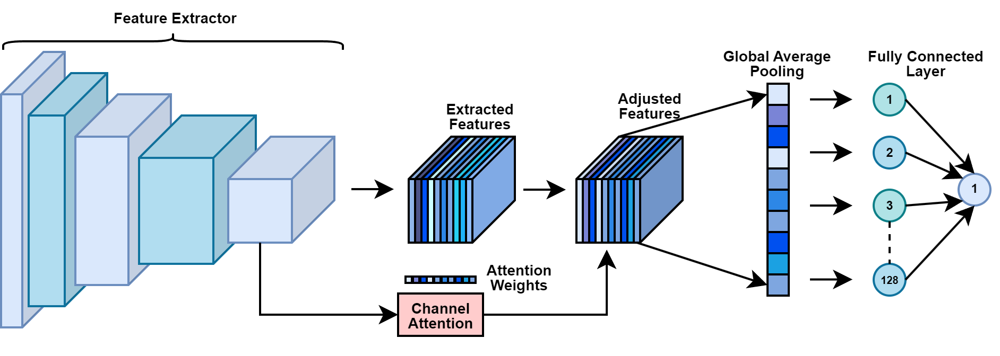

# Optimizing Feature Representation of Deep Neural Networks for Enhanced Deepfake Detection
### *Ashraf Ul Alam, Sudipta Progga Islam* 
---

This project focuses on optimizing feature representation of Deep Neural Networks (DNN) for enhanced deepfake detection. We leverage **VGG16**, known for its deep architecture, along with a channel attention mechanism to enhance model performance by prioritizing the most relevant feature vectors, which ultimately leads to optimized model training. In this study, we utilize deepfake images from the **140k Real and Fake Faces** dataset on Kaggle. Additionally, we perform an ablation study with **ResNet50** to compare feature extraction performance. 

## Dataset

The dataset consists of 140,000 images:  
- **70,000 Real Faces**: From the Flickr dataset collected by Nvidia  
- **70,000 Fake Faces**: Generated using StyleGAN by Bojan.

We utilized the given train, validation, and test sets from [Kaggle Dataset](https://www.kaggle.com/datasets/xhlulu/140k-real-and-fake-faces/data), but Images have been resized to 224px by 224px.

## Methodology

We implemented the **VGG16** deep learning model for classification, enhanced by a **channel attention mechanism** to prioritize relevant feature channels and suppress less useful ones. This attention mechanism helps the model focus on critical features, improving overall classification accuracy.

### Models Used:
1. **VGG16**: 
   - Accuracy: **99.64%**
   - **VGG16 with Channel Attention**: Accuracy improved to **99.80%**.

2. **ResNet50** (Ablation Study):
   - Accuracy: **96.65%**
   - **ResNet50 with Channel Attention**: Accuracy improved to **98.41%**.

## Results

| Model                | Accuracy  | Precision | Recall |
|----------------------|-----------|-----------|--------|
| ResNet50             | 96.65%    | 99.87%    | 93.42% |
| ResNet50 + Attention | 98.41%    | 99.70%    | 97.11% |
| VGG16                | 99.64%    | 99.92%    | 99.35% |
| VGG16 + Attention    | 99.80%    | 99.92%    | 99.65% |

The addition of channel attention enhanced the model's performance by focusing on the most relevant features. The **VGG16 with Channel Attention** model outperformed all other configurations, achieving an accuracy of **99.80%**.
